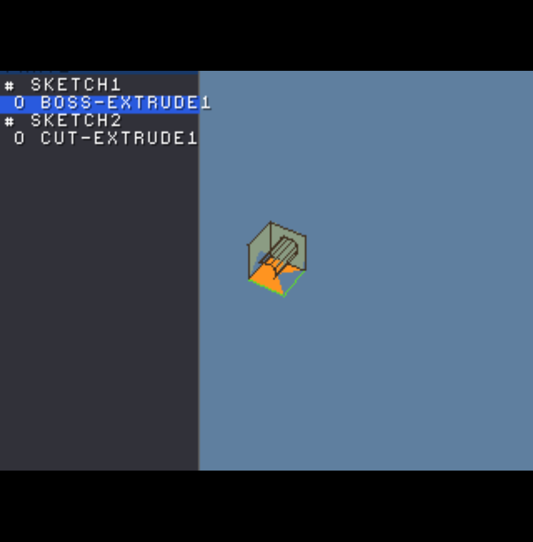

# MiniCAD-PSX

A feature-based **parametric 3D solid modeller that runs as a PlayStation 1 executable**.
SolidWorks-style interface and FeatureManager tree, DualShock input, memory-card saves —
all in integer math on 2 MB RAM / 1 MB VRAM with no FPU.

> **Status:** builds to a real `PS-X EXE` and runs as an **interactive modeller** on DuckStation
> at a stable 60 fps. You can **orbit/zoom/pan** the part, **pick faces/edges/vertices** with a
> cursor (hover-highlight + X to select), watch the selection light up in a **SolidWorks-style
> FeatureManager tree** down the left, **author new boss/cut extrudes on a picked face** with live
> preview + undo/redo, and **save/load to a memory card** (a real PS1 save the BIOS browser shows,
> round-trips through the PC ripper). The through-cut fuses into a **single solid with a real
> see-through bore**. The integer kernel is host-unit-tested (153 checks, clean under ASan/UBSan +
> `-Wconversion`). All seven capabilities were built and validated this round; see the shots below.




See **[DESIGN.md](DESIGN.md)** for the full architecture and the rationale behind every decision.
See **[HARDWARE_REVIEW.md](HARDWARE_REVIEW.md)** for the R3000A/GTE/PSn00bSDK optimization pass
(GTE-matrix scaling, scratchpad use, perspective-overflow handling, frame-loop overlap, baked
sine table). This README is just how to build and where things are.

## Why this exists / core ideas
- **The feature tree is the file.** A part is a *recipe* (sketch → extrude/revolve + reference
  geometry), not a mesh. The demo cube-with-hole serializes to **94 bytes**. Geometry is
  regenerated on load and re-tessellatable at any resolution.
- **No floats anywhere.** Coordinates are integer *myriometers* (1 = 0.1 mm). "mm" is a
  display-time string trick. The GTE (integer coprocessor) is the transform engine; trig comes
  from a 4096-step integer sine table. This is mandated by PS1 hardware *and* makes the kernel
  host-testable (integer code runs identically off-target).
- **Interop by construction.** The kernel compiles twice — MIPS for the console, host GCC for
  tests and the memory-card ripper — so a part authored on PS1 is bit-identical on PC and can be
  re-exported to STEP/OBJ there.

## Layout
```
include/minicad/   public headers (the module contracts)
src/foundation/    fixed-point myriometer math, sine table, arenas/pools, integer vec/mat
src/kernel/        half-edge B-rep, extrude/revolve, .mcad save codec   (host + PSX)
src/model/         feature tree + dependency regen                      (host + PSX)
src/render/        GTE + ordering-table painter's-algorithm renderer    (PSX only)
src/input/         DualShock polling + the CAD interaction model        (PSX only)
src/main.c         entry point; builds the demo part from features
host_tests/        unit tests (string fmt, sine, save round-trip, extrude topology)
tools/rip_mcad.py  Python ripper: extract .mcad saves from a raw card image
DESIGN.md          the master design / prompting document
```

## Build & test (host — no PlayStation needed)
```bash
cmake -B build -DCMAKE_BUILD_TYPE=Debug
cmake --build build
./build/test_kernel          # or: ctest --test-dir build
```
The Debug config enables ASan + UBSan (UBSan guards the integer-overflow surface). Expect:
```
encoded part size: 94 bytes
PASSED (0 failures)
```

Or compile the tests directly without CMake:
```bash
gcc -std=c11 -Wall -Wextra -Wconversion -Iinclude -DMINICAD_HOST \
    src/foundation/*.c src/kernel/*.c src/model/*.c src/app/*.c host_tests/test_kernel.c \
    -lm -o test_kernel && ./test_kernel
```

## Build the PlayStation executable
Requires [PSn00bSDK](https://github.com/Lameguy64/PSn00bSDK) (open-source, PsyQ-compatible)
**and its bare-metal `mipsel-none-elf` GCC** — *not* the distro `mipsel-linux-gnu` cross
compiler, which targets the Linux ABI and will not link. Grab both from the v0.24 release
(`gcc-mipsel-none-elf-12.3.0-linux.zip` + `PSn00bSDK-0.24-Linux.zip`).

Easiest — the helper pins the toolchain/SDK paths and env for you:
```bash
tools/build_psx.sh          # or: tools/build_psx.sh clean
# -> build-psx/minicad.exe   (sideload in DuckStation / PCSX-Redux, or burn to disc)
```
Or invoke CMake directly once `PSN00BSDK_LIBS` and `PATH` point at the SDK + toolchain:
```bash
cmake -B build-psx -DCMAKE_TOOLCHAIN_FILE="$PSN00BSDK_LIBS/cmake/sdk.cmake"
cmake --build build-psx
```

## Extract saves from a memory card
```bash
python3 tools/rip_mcad.py card.mcr            # list MiniCAD saves
python3 tools/rip_mcad.py card.mcr --extract  # write .mcad files
```
Works on standard 128 KB `.mcr/.mcd/.bin` dumps from DuckStation/PCSX or a hardware dumper.

## Status (what's real vs. TODO)
**Kernel — working and host-tested (153 assertions pass; clean under ASan+UBSan + `-Wconversion`):**
- Myriometer math + mm string formatter, integer sine/cos table
- Arena + pool allocators with a memory budget
- Integer half-edge B-rep with **automatic twin pairing** (edge table) + Euler check
- `op_extrude` boss: rectangle **and circle** profiles → prism/cylinder, fully stitched
- `op_revolve`: full and partial sweeps about an axis (offset-rect → tube), ring stitching + end caps
- **End conditions**: Blind / Through-All (cut-only, enforced) / Up-To-Surface (ray-to-plane, integer)
- **Boss vs. Cut** operation type, orthogonal to end condition
- **Cut → single solid with faces-with-holes** ✅ — the through-cut now *fuses* into the target:
  the pierced caps become faces-with-holes and the bore wall is adopted into the same shell, so
  the demo regenerates as **one body** (was two). Validated with the generalized Euler-Poincaré
  check `V−E+F−R = 2(S−G)` (genus-1 → residual 0), no unpaired half-edges.
- **`Sketch2` is the modeller's sketch type** ✅ — features now embed the full parametric sketcher
  (shared points + entities-by-reference, construction flag, line/rect/circle, trim, integer
  line-line & line-circle intersection); profile extraction + the `.mcad` codec (v2) run on it.
- **Constraint solver** ✅ — direct rules (coincident/horizontal/vertical/equal/fix) *plus* a
  fixed-point iterative solver (`sk_solve`) that converges **dimension / parallel / perpendicular /
  tangent**.
- Feature tree + dependency-ordered regen; `.mcad` compact codec (varint, crc32, carries
  op/end/target) — 94-byte round-trip for the demo
- **Undo/redo** (`app/history.h`): 10-deep snapshot ring over the `.mcad` codec; full semantics tested
- Python memory-card ripper (directory parse, block-chain, crc32)
- **Modeling core** (`app/modeling.c`, portable + host-tested): `plane_from_face`, pool-resetting
  `model_regen_all`, and begin/set-distance/confirm/cancel for boss & cut extrudes

**PS1-only layer — built against PSn00bSDK and validated on DuckStation:**
- **Orbit/zoom/pan camera** (`render/camera.c`) — model→render scale baked into the GTE matrix
  (no software scale pass); damped per-axis velocity filter; yaw-wrap, pitch clamp (no gimbal
  flip); 6-view snap; zoom-to-fit; recenter.
- **GTE ordering-table renderer** (`render/render.c`) — `ldv3→rtpt→nclip→avsz3→stotz` loop,
  perspective-overflow FLAG guard, `(otz>>2)` bucketing with coplanar tie-break, scratchpad
  working verts, wireframe-on-move, double-buffered OT build overlapping GPU draw. **Faces-with-
  holes render as a see-through annulus** so the bore reads as a real hole on the pierced face.
- **Picking** — an on-screen cursor picks the nearest face/edge/vertex of the active filter in
  screen space; hover highlights (yellow), **X (Cross) commits** the selection (orange); it stays
  lit and drives the FeatureManager.
- **FeatureManager tree** (`render_panel`) — SolidWorks-style left panel listing the feature tree
  with per-kind icons + dependency-depth indentation; the picked face's feature highlights.
- **Interactive modeling** — with a face selected, **△ starts a boss / □ a cut** on it, the d-pad
  nudges the distance with **live preview**, **X confirms** (commit + undo/redo), **○ cancels**.
- **Memory-card save/load** — `io/memcard.c` writes a real single-block PS1 save (title frame +
  16×16 icon + the `.mcad` payload) via the BIOS file API under the `BASLUS-MCAD` name the PC
  ripper recognizes; **Select+Start save, Select+L1 load, Select+R1 new**. Round-trip verified:
  saved on-console → `rip_mcad.py` extracts it, CRC OK → loaded back, geometry restored.
- `foundation/sintab.c` — **baked ROM sine table** (host-generated, bit-exact vs libm).

**Still TODO (clearly marked in source — best places to continue):**
- Trim "segment between intersections" (delete-whole-entity fallback today; intersection math ready)
- General line-chain profiles (`profile_to_ring` handles rect + circle; open line-chains next)
- Reference-geometry datum computation (plane/axis/point from parents)
- **Shell feature**: offset faces inward + remove selected faces — the half-edge adjacency fits it
- Multi-file card saves (single fixed slot today)
- Force the DualShock into analog mode at boot (needs a config-mode SPI handshake;
  today the pad boots digital and the D-pad orbits as a fallback until analog is toggled)

## Prior art to lean on (this is deliberately not novel)
PSn00bSDK examples · nocash psxspx specs · Pikuma "How PS1 Graphics Work" · Psy-Q ordering-table
technote · Solvespace (parametric sketcher) · FreeCAD/OpenCASCADE (feature-tree + B-rep structure).
