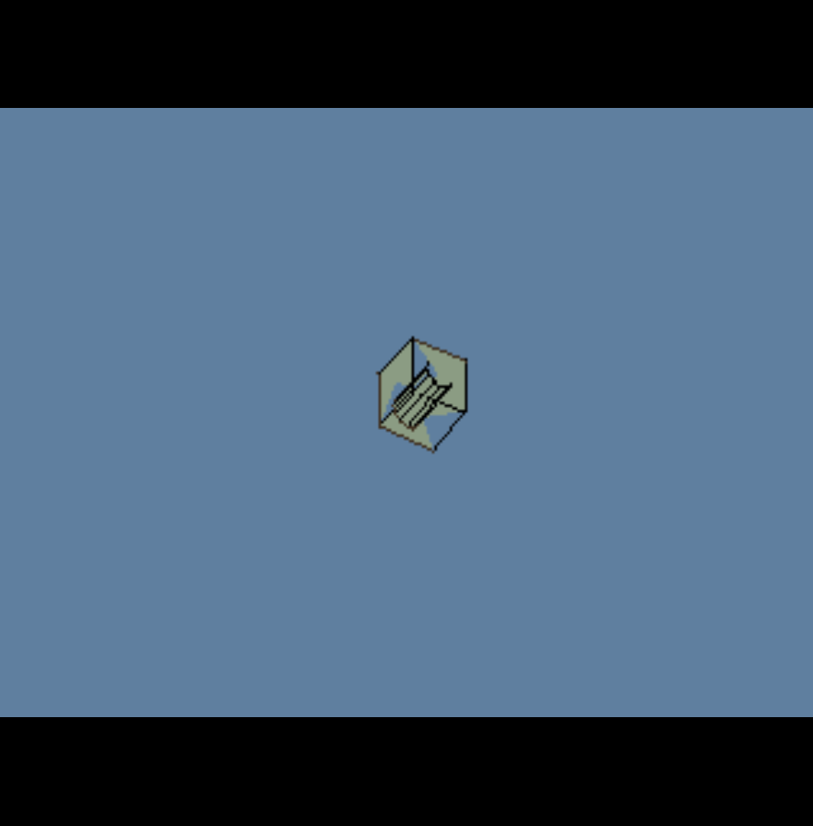

# MiniCAD-PSX

A feature-based **parametric 3D solid modeller that runs as a PlayStation 1 executable**.
SolidWorks-style interface and FeatureManager tree, DualShock input, memory-card saves —
all in integer math on 2 MB RAM / 1 MB VRAM with no FPU.

> **Status:** builds to a real `PS-X EXE`, **boots and renders the demo part** (a 60 mm cube
> with a Ø30 bore) shaded at a stable 60 fps in DuckStation, with an orbit camera over the GTE
> ordering-table renderer. The integer kernel is host-unit-tested (67 checks, clean under
> ASan/UBSan + `-Wconversion`). Verified by sideloading into DuckStation; see the screenshot below.



See **[DESIGN.md](DESIGN.md)** for the full architecture and the rationale behind every decision.
See **[HARDWARE_REVIEW.md](HARDWARE_REVIEW.md)** for the R3000A/GTE/PSn00bSDK optimization pass
(GTE-matrix scaling, scratchpad use, perspective-overflow handling, frame-loop overlap, baked
sine table). This README is just how to build and where things are.

## Why this exists / core ideas
- **The feature tree is the file.** A part is a *recipe* (sketch → extrude/revolve + reference
  geometry), not a mesh. The demo cube-with-hole serializes to **34 bytes**. Geometry is
  regenerated on load and re-tessellatable at any resolution.
- **No floats anywhere.** Coordinates are integer *myriometers* (1 = 0.1 mm). "mm" is a
  display-time string trick. The GTE (integer coprocessor) is the transform engine; trig comes
  from a 4096-step integer sine table. This is mandated by PS1 hardware *and* makes the kernel
  host-testable (integer code runs identically off-target).
- **Interop by construction.** The kernel compiles twice — MIPS for the console, host GCC for
  tests and the memory-card ripper — so a part authored on PS1 is bit-identical on PC and can be
  re-exported to STEP/OBJ there.

## Layout
```
include/minicad/   public headers (the module contracts)
src/foundation/    fixed-point myriometer math, sine table, arenas/pools, integer vec/mat
src/kernel/        half-edge B-rep, extrude/revolve, .mcad save codec   (host + PSX)
src/model/         feature tree + dependency regen                      (host + PSX)
src/render/        GTE + ordering-table painter's-algorithm renderer    (PSX only)
src/input/         DualShock polling + the CAD interaction model        (PSX only)
src/main.c         entry point; builds the demo part from features
host_tests/        unit tests (string fmt, sine, save round-trip, extrude topology)
tools/rip_mcad.py  Python ripper: extract .mcad saves from a raw card image
DESIGN.md          the master design / prompting document
```

## Build & test (host — no PlayStation needed)
```bash
cmake -B build -DCMAKE_BUILD_TYPE=Debug
cmake --build build
./build/test_kernel          # or: ctest --test-dir build
```
The Debug config enables ASan + UBSan (UBSan guards the integer-overflow surface). Expect:
```
PASSED (0 failures)
encoded part size: 34 bytes
```

Or compile the tests directly without CMake:
```bash
gcc -std=c11 -Wall -Wextra -Wconversion -Iinclude -DMINICAD_HOST \
    src/foundation/*.c src/kernel/*.c src/model/*.c src/app/*.c host_tests/test_kernel.c \
    -lm -o test_kernel && ./test_kernel
```

## Build the PlayStation executable
Requires [PSn00bSDK](https://github.com/Lameguy64/PSn00bSDK) (open-source, PsyQ-compatible)
**and its bare-metal `mipsel-none-elf` GCC** — *not* the distro `mipsel-linux-gnu` cross
compiler, which targets the Linux ABI and will not link. Grab both from the v0.24 release
(`gcc-mipsel-none-elf-12.3.0-linux.zip` + `PSn00bSDK-0.24-Linux.zip`).

Easiest — the helper pins the toolchain/SDK paths and env for you:
```bash
tools/build_psx.sh          # or: tools/build_psx.sh clean
# -> build-psx/minicad.exe   (sideload in DuckStation / PCSX-Redux, or burn to disc)
```
Or invoke CMake directly once `PSN00BSDK_LIBS` and `PATH` point at the SDK + toolchain:
```bash
cmake -B build-psx -DCMAKE_TOOLCHAIN_FILE="$PSN00BSDK_LIBS/cmake/sdk.cmake"
cmake --build build-psx
```

## Extract saves from a memory card
```bash
python3 tools/rip_mcad.py card.mcr            # list MiniCAD saves
python3 tools/rip_mcad.py card.mcr --extract  # write .mcad files
```
Works on standard 128 KB `.mcr/.mcd/.bin` dumps from DuckStation/PCSX or a hardware dumper.

## Status (what's real vs. TODO)
**Working and tested on host (28 assertions pass; clean under ASan+UBSan):**
- Myriometer math + mm string formatter, integer sine/cos table
- Arena + pool allocators with a memory budget
- Integer half-edge B-rep with **automatic twin pairing** (edge table) + Euler check
- `op_extrude` boss: rectangle **and circle** profiles → prism/cylinder, fully stitched,
  Euler V−E+F=2 verified for both
- `op_revolve`: full and partial sweeps about an axis (offset-rect → tube), ring stitching + end caps
- **End conditions**: Blind / Through-All (cut-only, enforced) / Up-To-Surface (ray-to-plane, integer)
- **Boss vs. Cut** operation type, orthogonal to end condition
- Feature tree + dependency-ordered regen (full cube-with-hole demo regenerates)
- `.mcad` compact codec (varint, crc32, carries op/end/target) — 35-byte round-trip
- Python memory-card ripper (directory parse, block-chain, crc32)
- **Undo/redo** (`app/history.h`): 10-deep snapshot ring over the compact `.mcad` codec; full
  semantics tested — undo/redo, redo-tail discard on a new edit, and oldest-snapshot eviction at
  the 10 cap.
- **Parametric sketcher** (`kernel/sketch.h`, `Sketch2`): shared points + entities-by-reference,
  construction-geometry flag, add line/rect/circle, **trim** (delete or to-construction),
  integer line-line & line-circle intersection, and a **direct-rule constraint resolver**
  (coincident/horizontal/vertical/equal/fix) with dimension/tangent/parallel recorded and
  flagged unsolved for the future solver. 11 sketcher assertions pass.

**Honest cut caveat (the one real limitation):** the cut currently builds the hole's inner
wall as its own solid (the demo regenerates as **2 solids**), rather than fusing into the
target as a single face-with-hole solid. The geometry and tessellation are correct and render
fine; what's missing is the shell merge so it reads as one body. `brep_build_face` already
supports inner (hole) loops — wiring the cut to turn the target's hit face into a face-with-hole
and adopt the wall is the next step. This is the pragmatic profile-on-a-face cut, not general CSG.

**Skeleton / TODO (clearly marked in source — best places to continue):**
- **Migrate feature/ops/save to `Sketch2`** (the full sketcher) from the legacy `Sketch` — the
  sketcher is built + tested standalone; wiring it as the modeller's sketch type is next
- **Fixed-point Newton constraint solver** consuming the `SkConstraint` list (dimension/tangent/
  parallel/perpendicular) — the data model + unsolved-count seam are already in place
- Trim "segment between intersections" (currently delete-whole-entity fallback; intersection
  math is implemented and ready to wire)
- Cut shell-merge (face-with-hole fusion into the target solid) — see `op_extrude` OP_CUT branch
- General line-chain profiles (`profile_to_ring` handles rect + circle; line-chains TODO)
- Reference-geometry datum computation (plane/axis/point from parents)
- **Shell feature** (planned): offset faces inward + remove selected faces — the half-edge
  adjacency now in place is exactly what this needs
**PS1-only layer — verified booting and rendering on DuckStation (PSn00bSDK build):**
These compile against PSn00bSDK and were boot-tested by sideloading `minicad.exe`. Bugs found
and fixed during that bring-up: GTE `AVSZ4`→`AVSZ3` (a stale SZ3 was far-clipping most faces),
the model→render zoom (was a no-op, and `FX_ONE*8` overflowed the int16 GTE matrix — clamped to
`*4`), DualShock input driving the camera to extremes (stick-gating + first-frame priming),
revolve face winding, and the through-cut depth (now spans the body, open-tube so no degenerate
caps). They implement the hardware-review actions:
- `render/camera.c` — orbit/zoom → GTE MATRIX with **model→render scale baked into the matrix**
  (no software scale pass); 6-view snap; zoom-to-fit.
- `render/render.c` — full GTE loop (`ldv3→rtpt→nclip→stopz→avsz4→stotz`), **perspective-overflow
  guard** via GTE FLAG, `(otz>>2)` bucketing with coplanar tie-break after the shift, edges one
  bucket in front, **scratchpad** working verts, wireframe-on-move, **double-buffered OT build
  overlapping GPU draw**.
- `input/input.c` — full DualShock map incl. filter scroll, selection verbs, d-pad value edit,
  and **undo/redo bound to Select+△ / Select+○** via the history ring.
- `foundation/sintab.c` — **baked ROM sine table** (host-generated, bit-exact vs libm), removing
  boot-time trig + int64 soft-divide from the target binary.
- `main.c` — frame loop with build/draw overlap, wiring input → camera → render.

**Still TODO:**
- Memory-card block write/read path + save icon TIM (the `.mcad` codec + ripper exist; the
  on-console card I/O is not wired yet)
- Migrate feature/ops/save onto the full `Sketch2` sketcher
- Fixed-point Newton constraint solver; cut shell-merge; general line-chain profiles
- Contextual-wheel + FeatureManager tree rendering on-console (designed; mockup shows the look)

## Prior art to lean on (this is deliberately not novel)
PSn00bSDK examples · nocash psxspx specs · Pikuma "How PS1 Graphics Work" · Psy-Q ordering-table
technote · Solvespace (parametric sketcher) · FreeCAD/OpenCASCADE (feature-tree + B-rep structure).
